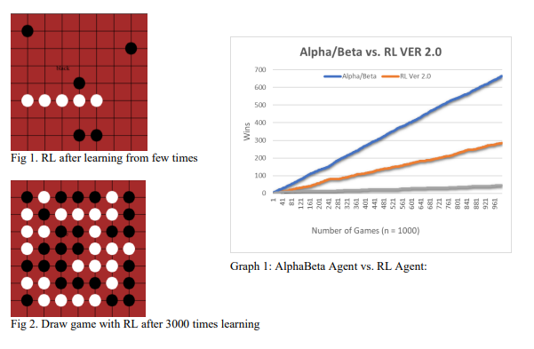
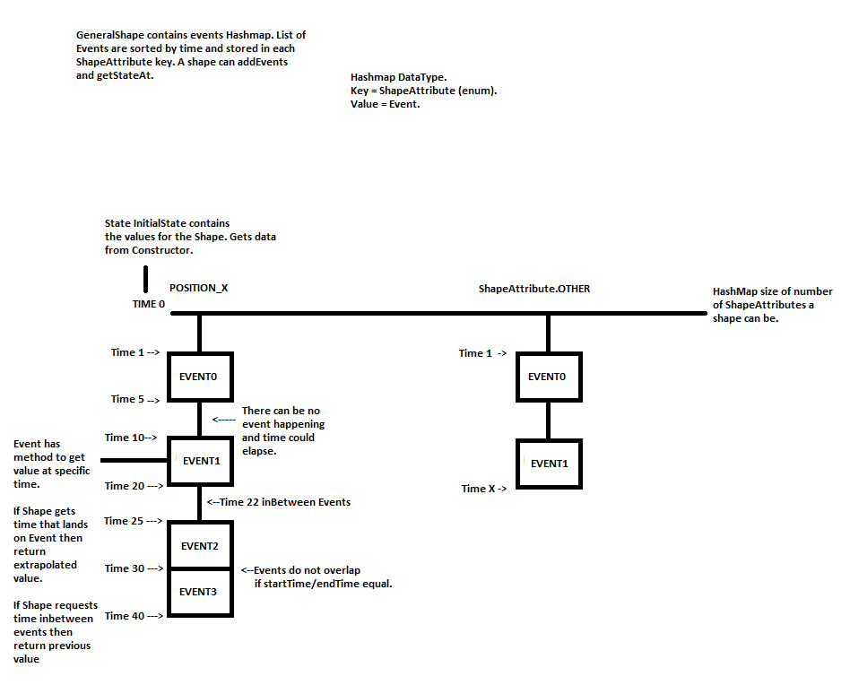

# Vitaliy_Portfolio
Computer Science Projects

**Project 1: MVC Animator Player: Project Overview**

•	Language: Java 

•	Description: Create an animator model, view, and controller using OOP principles.

•	Model takes in .txt file, parses it, and outputs an animation.
   
Refer to APPENDIX for model diagram. 

**Followup:**
•	Created two separate mini-game engines to expand on principles from the animator project.
•	Introduced active input, interaction with objects, switches, and screen movement.

  Video Demo 1: https://youtu.be/nOJP3kSv3BE
  Video Demo 2: https://www.youtube.com/watch?v=Xqp5Wpj5Hu4

**Project 2: Reinforced Learning for Omok: Project Overview**

•	Language: Python
•	Description: Create an Omok game with a reinforced learning agent and compare it to other AI agents. 
•	Abstract: The project aims to find a winning solution for a game called Gomoku (“Omok”) by using Alpha/Beta (A/B) and Approximate Reinforcement Learning (RL) algorithms. The two separate implementations are then compared against each other in terms of speed, efficiency, and win-rate. The A/B algorithm was ideal to investigate because there are only two players, and each move can be evaluated in simple min or max logic. Meaning that the AI can optimize its strategy while minimizing its opponents. The second implementation involved approximate RL. This method relies on an AI agent learning by experience/exploration and creating an optimal policy to follow against the other player. The results revealed that with small board sizes (7X7) A/B agent performed better than the RL agent. However, as the board size increased, the A/B agent struggled with the search space and was outperformed by the RL agent in terms of time efficiency. 

**Project 3: Insurance NLP: Project Overview, Work in Progress**
• Language: Python
• Description: Pre-process real unstructured data (100k entries) from an insurance company and automate the process of taking reported injuries and categorizing them     correctly. The project aims to accurately predict the cause of injury using short free-form text descriptions.

     Pre-Processing Data: Under/Over Sampling, CrossFold Validation, count/tf-idf vectorization
     Data Exploration: T-SNE mapping, Word2Vec
     Models: Naive Bayes, Support Vector Machine, XGboost
     Evaluation: Data visualization, cross-validation, confusion matrix, F1 score, and accuracy

**APPENDIX**

